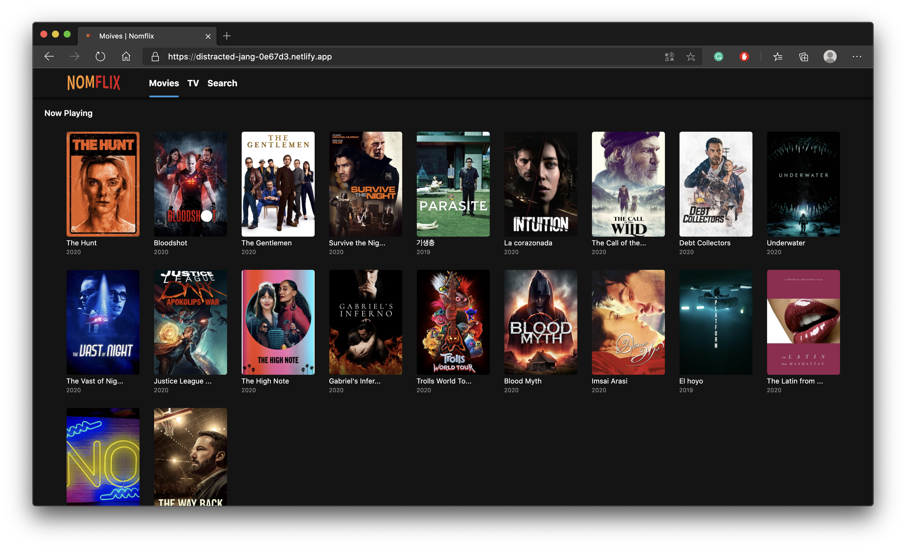

# Nomflix
## 목차

## 개요

[배포 사이트](https://distracted-jang-0e67d3.netlify.app/)
- Nomad Coder의 ReactJS 2주 챌린지에 참가하면서 개발.
- TMDb의 API를 통해 영화 및 TV시리즈의 데이터를 이용하여 개발.
- styled-components를 사용하여 스타일링.
- Container/Presenter 패턴으로 개발.
</img>

## 구현 소개
### 1. TMDb API 모듈
</img>

### 2. Header
- Router모듈에 Header모듈과 라우트를 함께 작성.

[Router.js]
```javascript
import React from 'react';
import { BrowserRouter as Router, Route, Redirect, Switch } from 'react-router-dom';
import Header from 'Components/Header';
import Home from 'Routes/Home';
import TV from 'Routes/TV';
import Search from 'Routes/Search';
import Detail from 'Routes/Detail';
import Collection from 'Routes/Collection';

export default () => (
  <Router>
    <>
      <Header />
      <Switch>
        <Route path="/" exact component={Home} />
        <Route path="/tv" exact component={TV} />
        <Route path="/search" component={Search} />
        <Route path="/movie/:id" component={Detail} />
        <Route path="/show/:id" component={Detail} />
        <Route path="/collections/:id" component={Collection} />
        <Redirect from="*" to="/" />
      </Switch>
    </>
  </Router>
);
```
- Router안에 Link와 Route를 함께 써줌으로써 path값에 따른 컴포넌트를 웹 페이지상에 그림.

[Header.js]
```javascript
import React from "react";
import { Link, withRouter } from "react-router-dom";
import styled from "styled-components";

const Header = styled.header`
    color: white;
    position: fixed;
    top: 0;
    left: 0;
    width: 100%;
    height: 50px;
    display: flex;
    align-items: center;
    padding: 0px 10px;
    background-color: rgba(20, 20, 20, 0.8);
    z-index: 10;
    box-shadow: 0px 1px 5px 2px rgba(0,0,0,0.8);
`;

const Logo = styled.div`
  width: 150px;
  height: 40px;
  background-image: url("/logo.png");
  background-position: center center;
  background-repeat: no-repeat;
  background-size: 90px;
  margin: 0 20px;
`;

const List = styled.ul`
    display: flex;
`;

const Item = styled.li`
  width: 50px;
  height: 50px;
  font-size: 15px;
  font-weight: bold;
  text-align: center;
  border-bottom: 3px solid
    ${props => (props.current ? "#3498db" : "transparent")};
  transition: border-bottom 0.5s ease-in-out;
  &:hover {
    background-color: #3498db;
  }
`;

const SLink = styled(Link)`
    height: 50px;
    display: flex;
    align-items: center;
    justify-content: center;
`;

export default withRouter(({ location: { pathname } }) => (
    <Header>
        <Logo />
        <List>
            <Item current={pathname === "/"}>
                <SLink to="/">Movies</SLink>
            </Item>
            <Item current={pathname === "/tv"}>
                <SLink to="/tv">TV</SLink>
            </Item>
            <Item current={pathname === "/search"}>
                <SLink to="/search">Search</SLink>
            </Item>
        </List>
    </Header>
));
```
- location객체를 사용하기 위해 withRouter를 사용.
- 메뉴 버튼을 클릭한 것을 CSS로 나타내주기 위해 Item에 current를 추가하였고 pathname에 따라 true/false의 값을 가짐. 또한 current는 styled-components에서 props로 접근 가능.

### 2. Home(Movie page) & TV(TV Series page)
- 현재 상영 중인, 개봉 예정인, 인기 있는 영화들을 보여주는 페이지.

    [HomeContainer.js]
    ```javascript
    import React from "react";
    import HomePresenter from "./HomePresenter";
    import {moviesApi} from "api";


    export default class extends React.Component{
        state = {
            nowPlaying: null,
            upcoming: null,
            popular: null,
            error: null,
            loading: true
        };

        async componentDidMount(){
        try{
            const {data: {results: nowPlaying}} = await moviesApi.nowPlaying();
            const {data: {results: upcoming}} = await moviesApi.upcoming();
            const {data: {results: popular}} = await moviesApi.popular();

            this.setState({
            nowPlaying,
            upcoming,
            popular
            });

        }catch(error){
            this.setState({
            error: "Can't find movie information."
            })

        }finally{
            this.setState({
            loading: false
            })
        }
        }

        render() {
            const { nowPlaying, upcoming, popular, error, loading } = this.state;

            return (
            <HomePresenter
                nowPlaying={nowPlaying}
                upcoming={upcoming}
                popular={popular}
                error={error}
                loading={loading}
            />
            );
        }
    }
    ``` 
    [HomePresenter.js]
    ```javascript
    import React from "react";
    import PropTypes from "prop-types";
    import styled from "styled-components";
    import {Helmet} from "react-helmet";
    import Section from "Components/Section";
    import Loader from "Components/Loader";
    import Message from "Components/Message";
    import Poster from "Components/Poster";

    const Container = styled.div`
        padding: 20px;
    `;

    const HomePresenter = ({ nowPlaying,    upcoming, popular, error, loading }) => (
    <>
        <Helmet>
        <title>Moives | Nomflix</title>
        </Helmet>
        {loading ? (
        <Loader />
        ) : (
        <Container>
            {nowPlaying && nowPlaying.length > 0 && (
            <Section title="Now Playing">
                {nowPlaying.map(movie => (
                <Poster
                    key={movie.id}
                    id={movie.id}
                    imageUrl={movie.poster_path}
                    title={movie.original_title}
                    rating={movie.vote_average}
                    year={movie.release_date && movie.release_date.substring(0, 4)}
                    isMovie={true}
                />
                ))}
            </Section>
            )}
            {upcoming && upcoming.length > 0 && (
            <Section title="Upcoming Movies">
                {upcoming.map(movie => (
                <Poster
                    key={movie.id}
                    id={movie.id}
                    imageUrl={movie.poster_path}
                    title={movie.original_title}
                    rating={movie.vote_average}
                    year={movie.release_date && movie.release_date.substring(0, 4)}
                    isMovie={true}
                />
                ))}
            </Section>
            )}
            {popular && popular.length > 0 && (
            <Section title="Popular Movies">
                {popular.map(movie => (
                <Poster
                    key={movie.id}
                    id={movie.id}
                    imageUrl={movie.poster_path}
                    title={movie.original_title}
                    rating={movie.vote_average}
                    year={movie.release_date && movie.release_date.substring(0, 4)}
                    isMovie={true}
                />
                ))}
            </Section>
            )}
            {error && <Message text={error} color="#e74c3c" />}
        </Container>
        )}
    </>
    );

    HomePresenter.propTypes = {
    nowPlaying: PropTypes.array,
    upcoming: PropTypes.array,
    popular: PropTypes.array,
    error: PropTypes.string,
    loading: PropTypes.bool.isRequired
    };

    export default HomePresenter;
    ```
    - componentDidMount에서 async/await로 영화 데이터들을 모두 가져온 후에 다음 동작을 하도록 동기처리 진행.
    - Container모듈에서 관련 데이터들의 비즈니스 로직을 진행하고 Presenter모듈에서 페이지 화면을 구성.
    - TV시리즈에 해당하는 Container모듈과 Presenter모듈 역시 위의 코드와 유사함.


## Screens

- [x] Home
- [x] TV Shows
- [x] Search
- [x] Detail

## API Verbes

- [x] Now playing (Movie)
- [x] Upcoming (Movie)
- [x] Popular (TV, Movie)
- [x] Top Rated (TV)
- [x] Airing Today (TV)
- [x] TV Show Detail
- [x] Movie Detail
- [x] Search (Movie, TV)

## Code Challenges

- [x] IMDB Link
- [X] Tabs inside of Movie / Show Details (YT Videos, Production Company & Countries)
- [x] Collections Link
- [x] /collections Route
- [x] On TV Show, show seasons
